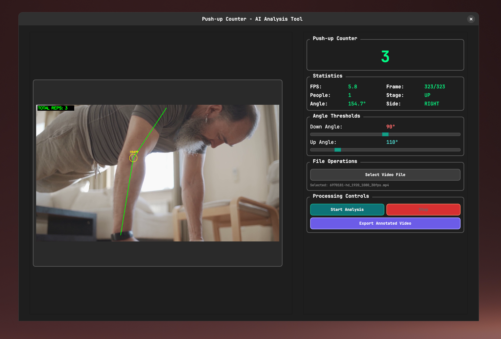

# Push-up Counter

This project is a real-time push-up counter that uses your webcam and a YOLOv8 pose estimation model to track and count your push-ups.

## Screenshot


## Features

*   **Real-time Push-up Counting:** Counts push-ups accurately from a live video stream.
*   **Pose Estimation:** Utilizes a YOLOv8 model to detect key body points for tracking movement.
*   **GUI Display:** A simple graphical interface to show the webcam feed and the current push-up count.

## How It Works

The application captures video from your webcam. For each frame, a YOLOv8 pose estimation model detects the position of your shoulders, elbows, and wrists. The angles of your elbows are calculated to determine the state of the push-up (up or down). The application counts a complete push-up cycle when you go from an "up" state to a "down" state and back to an "up" state.

## Setup and Installation

Follow these steps to get the project running on your local machine.

### 1. Clone the Repository

```bash
git clone <repository-url>
cd pushup_counter
```

### 2. Create a Virtual Environment

It is highly recommended to use a virtual environment to manage the project's dependencies.

```bash
python -m venv .venv
source .venv/bin/activate
```
On Windows, use:
```
.venv\Scripts\activate
```

### 3. Install Dependencies

Install all the required Python packages using the `requirements.txt` file.

```bash
pip install -r requirements.txt
```

### 4. Download Model Files

The application requires pre-trained YOLO model files (`yolo11n-pose.pt` and `yolo11m-pose.pt`). These are included in the repository, but if you need to re-download them, you can find them from the Ultralytics library resources.

### 5. Run the Application

You can run the push-up counter from your terminal.

To run the main application (with GUI):
```bash
python gui.py
```

To run the core push-up counting logic (console-based):
```bash
python pushup_counter.py
```

## Dependencies

This project relies on the following major libraries:

*   **PyQt6:** For the graphical user interface.
*   **OpenCV (cv2):** For capturing and processing video from the webcam.
*   **Ultralytics (YOLO):** For the pose estimation model.
*   **NumPy:** For numerical operations.
*   **PyTorch:** As a backend for the YOLO model.
